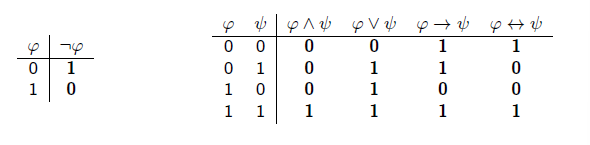

# 02180 Introduction to Artificial Intelligence

## Topics Covered

|Week               | Title     | Topics |
|:------------------|:----------| :----- |
| [Week 1](#week-1-introduction) | Introduction | Turing test   Symbolic   Sub-symbolic|
| [Week 2](#week-2-uninformed-search) | Uninformed Search | Search problem    Tree search   Graph search   BFS DFS|
| [Week 3](#week-3-informed-search) | Informed Search | Uniform-cost search   Best-first search   Greedy BFS   A*star|
| [Week 4](#week-4-non-determinism-partial-observability) | Non-determinism   Partial Observability | And-Or trees   Conditional plans   Belief states   Percept, update, results |
| [Week 5](#week-5-adversarial-search) | Adversarial Search| MiniMax   Alpha-beta pruning   Evaluation function |
| [Week 6](#week-6-monte-carlo-tree-search) | Monte Carlo Tree Search| |
| [Week 8](#week-8-logical-agents) | Logical Agents| Entailment   Model checking   Propositional logic |
| [Week 9](#week-9-belief-revision-i) | Belief Revision I| AGM belief revision model   Revision, contraction, expansion   Plausibility orders |
| [Week 10](#week-10-logical-inference) | Logical Inference| Propositional theorem proving   Inference rules   Resolution   Conjunctive normal form   Definite & Horn clauses |
| [Week 11](#week-11-belief-revision-ii) | Belief Revision II| AGM Postulates   Remainders $A \bot \varphi$   Partial meet contraction   Belief bases & sets   Entrenchment |

## Miscellaneous

| $p$ | $q$ | $p \vee q$ | $p \wedge q$ | $p \rarr q$ | $p \larr q$ | $ p \lrarr q$ |
|---|---|---|---|---|---|---|
| 0 | 0 | 0 | 0 | 1 | 1 | 1 |
| 0 | 1 | 1 | 0 | 1 | 0 | 0 |
| 1 | 0 | 1 | 0 | 0 | 1 | 0 |
| 1 | 1 | 1 | 1 | 1 | 1 | 1 |

Standard logical equivalences

$A \rarr B \equiv \neg A \vee B$

## Week 1 Introduction

[Back to top](#topics-covered)

### Turing test

- behavioural intelligence test
- the machine passes if the judge cannot tell the machine's and human's performance apart
- match/outperform/mimic/complement

- John McCarthy: *Artificial intelligence is the science and engineering of making intelligent machines, especially intelligent computer programs.*

### Symbolic VS Sub-symbolic

- symbolic: simulates human symolic, conscious reasoning.
  - e.g. search, planning, logical reasoning
  - e.g. A*star, natural language processing
- sub-symbolic: simulates fundamental physical/neural processes
  - neural networks, kNN, machine learning, deep learning

Environment Types

- observability: full/partial
- single/multi-agent
- competive/cooperative
- deterministic/stochastic
- static/dynamic

## Week 2 Uninformed Search

[Back to top](#topics-covered)

No sense of closeness to the goal.

Informed: heuristics used to give sense of closeness to the goal

### Search problem

- initial state
- goal state
- goal-test(s): returns true if $s$ is goal state
- actions(s): set of actions applicable in state $s$
- results(s,a): state $s'$ reached from $s$ by action $a$
- stepcost(s,a) cost of executing $a$ in $s$

Other terms

- solution: sequence of actions (path) from $s_0$ to goal state. optimal if has the minimum sum of step costs.
- state space: total number of possible states, consists of each possible configuration

Vacuum World

- State space: $2\cdot2^2$ possible states
- s0: Initial state
- Actions(s): for each state three possible actions: L, R, S.
- Results(s; a): actions have their expected results.
- Goal-Test(s): are all squares clean?
- Step-Cost(s; a): each step costs 1.

### Tree Search

- does not keep track of repeated states
- expanded: all children nodes have been generated
- frontier: generated nodes but not expanded

### Graph Search

- keeps track of already generated states, unlike tree search

Breadth-first search (BFS)

- frontier is a queue, FIFO
- slower, explores more nodes, but guarantees optimal solution

Depth-first search (DFS)

- frontier is stack, LIFO
- typically faster than BFS

Measure performance using completeness, optimality, time complexity, space complexity

## Week 3 Informed Search

[Back to top](#topics-covered)

Heuristics: provides extra information about actions/transitions

e.g. straight line distance from node to goal

### Uniform-cost Search

- all steps are equal, BFS is optimal
- node selection for expansion is based on path-cost $g(n)$
- frontier: priority queue ordered by $g$
- goal-test applied when the node is selected for expansion

### Best-first Search

- node selection for expansion is based on evaluation function $f(n)$
- frontier: priority queue ordered by $f$
- include a heuristic function in $f$
  - $f(n) = g(n) + h(n)$

Heuristics, $h(n)$

- estimated cost of the cheapest path from node $n$ to a goal state
- if $n$ is a goal node, then $h(n) = 0$

Greedy Best-first Search

- $f(n) = h(n)$
- greedy, incomplete, complexity of tree version is as DFS

A*star

- $f(n) = g(n) + h(n)$
  - $g(n)$: cost to reach node
  - $h(n)$: estimated cost to get from node to goal
- is optimal when heuristic $h$ is admissable

### Heuristics

- optimal cost of node $n$, $h^*(n)$: minimal cost to achieve goal from $n$
- **Admissable**: cost of reaching the goal is never overestimated
  - always optimistic
  - $h(n) \le h^*(n)$ for all nodes n
  - e.g. straight line euclidean distance as $h(n)$ is admissable
- **Consistency**: $h(n) \le c(n,a,m) + h(m)$
  - consistent h implies admissability

- **Dominating**: $h_2$ is dominating $h_1$ if $h_2(s) \ge h_1(s)$ for all s
- Tip: generate heuristics via relaxed problems

## Week 4 Non-determinism, Partial Observability

[Back to top](#topics-covered)

### Non-determinism

Erractic

- when applied the action *suck*, it cleans the square, and sometimes cleans up dirt in adjacent square
- when applied the action *suck*, it cleans the square, and sometimes deposits dirt in adjacent square

Search problem

- s0: Initial state
- Actions(s): for each state three possible actions: L, R, S.
- Results(s; a): applying a in s leads to a **set of states** $S'$.
  - Results(1,suck) - {5,7}
  - Results((d,d,1), suck) = {(c,d,1),(c,c,1)}
- Goal-Test(s): are all squares clean?
- Step-Cost(s; a): each step costs 1.

### And-Or Trees

- Deterministic actions
  - represented using $OR$ nodes
  - solution is a path in state space
  - turned into a sequence of actions (sequential plan)

- Non-determinisitic actions
  - represented using $AND$ nodes
  - solution is a subtree of state space
  - turned into a conditional plan (contingency plan)

Conditional plans

- $\pi ::= \epsilon | a |$ if $s$ then $\pi_1$ else $\pi_2 | \pi_1; \pi_2$
  - $\epsilon$: empty plan (usually upon reaching goal state)
  - $a$: action
  - $s$: state
  - $\pi_1;\pi_2$: first execute $\pi_1$ then $\pi_2$ (sequential composition)
- $\pi =$ Suck; if $s_5$ then (Right; Suck)

Policy

- a mapping from states to Actions
- $\sqcap: \sqcap(s_1) =$ Suck, $\sqcap(s_5)$ = Right, $\sqcap(s_6)$ = Suck

And-Or Graph Search

- Or-Search: when all actions are deterministic
- there is some pseudocode in the slides

Cyclic solutions

- subtrees where every leaf is either a goal or loop node
- guarantees reaching goal when assuming fairness (every possible outcome will eventually happen)
- requires conditional plans with loops
  - e.g. *while cond do $\pi_1$*
  - e.g. *Suck; Right; while not in 6 do Right; Suck*

### Partial Observability

Full state observability 
Partial observability  
Null observability (conformant problems)

Belief states, $b$

- a set of physical states, $s$
- contains the states considered possible by an agent in a given state
- $n$ states $\rarr 2^n$ belief states

Percept(s)

- codes the observation made by the agent in state $s$
- e.g. Percepts(s) = dirty
- Full observability: Percepts(s) = {s}
- Null observability: Percepts(s) = {0}

Possible-Percepts

- takes belief state $b$
- returns all possible observations

Update

- takes belief state $b$ and observation $o$
- filters away states that not consistent with observation
- returns a set of possible states that are consistent with observation

Results

- takes observations into account
- returns a set of belief states (a set of sets of states)

## Week 5 Adversarial Search

[Back to top](#topics-covered)

Zero-sum games

- payoffs in each cell (game outcome)sums up to 0
- games with pure conflict

Games

- $s_0$: initial state
- Player(s): who has the move in s
- Actions(s): Legal moves in s
- Result(s, a): transition model
- Terminal-Test(s): terminal test, is the game over?
- Utility(s; p): utility/payoff function
  - Numerical value for player $p$ in terminal state $s$.
  - e.g. +1 for win and -1 for loose (zero-sum)

### MiniMax

- 2 players: max, min
  - max: chooses the move the maximises the minimax value
  - min: chooses the move the minimises the minimax value
- zero-sum game
- nodes assigned values representing expected utility for max
- form of DFS search

Example

### Alpha-beta Pruning

- makes the game tree smaller, computationally efficient
- $\alpha$: lower bound on what MAX can achieve playing up till the current node
- $\beta$: upper bound on what MIN can achieve playing up till the current node
- root node: $\alpha = -\infty, \beta = \infty$

Max node

- passes $\alpha$-value down
- passes $\beta$-value up
- $\bm{\beta}$ **cut**: $v \ge \beta$
  - min has better previous choice
  - max has too good of a current choice

Min node

- passes $\beta$-value down
- passes $\alpha$-value up
- $\bm{\alpha}$ **cut**: $v \le \alpha$
  - max has a better previous choice
  - min has too good of a current choice

Evaluation function

- expected utility when searching to the end is not possible
- estimate of how "good" the state is

ExpectiMax

- play against Chance, probabilistic decisions

## Week 6 Monte Carlo Tree Search

[Back to top](#topics-covered)

- Reinforcement learning and MiniMax
- Non-uniform tree expansion with most promising states first
- Evaluation based on monte-carlo sampling/random play-outs
- Converges to Minimax

Evaluation of state $s$: play $n$ random full games from state s, take average utililty of resulting games

Upper confidence bound for node t, $UCB(t) = \frac{r_t}{n_t} + \sqrt{\frac{2 \ln n_s}{n_t}}$

Workflow

1. Selection
    - node on the frontier is selected for expansion
    - start at the root, find a path to a frontier node by selecting the best child
    - use UCB to find best child
2. Expansion
    - expand selected node
    - add it to frontier
3. Simulation
    - play a random game from generated child node
4. Backup
    - update evalation of all nodes on path from the root to the generated child node based on the playout

## Week 8 Logical Agents

[Back to top](#topics-covered)

Validity

- if there is transmission of truth
- if all premises are true, the conclusion is also true
- if the conclusion is false, at least one premise is false

Knowledge base

- set of sentences
- sentence: assertions about the world in a knowledge representation language
- axioms: sentences that must be true
- Add (TELL), query (ASK), inference rule (TELLed): return what it has been told before

Entailment, $\psi \models \varphi$

- $\varphi$ follows from $\psi$
- logical inference

Model checking

- enumerate all models of KB, check if the conclusion holds
- $KB \vdash \varphi$: sentence $\varphi$ derived from KB

### Language of Propositional Logic

| Symbol | Meaning |
| -- | :-- |
| $\wedge$ | Conjunction, AND |
| $\vee$ | Disjunction, OR |
| $\neg$ | Negation, NOT |
| $\rarr$ | Implication, IMPLES |
| $\lrarr$ | Bi-implication, IF AND ONLY IF |
| $\top$ | True |
| $\bot$ | False |

- $p,q,r,...$: every proposition letter is a formula
- If $\varphi$ is a forumla, $\neg \varphi$ is a formula
- $(\phi_1 \wedge \phi_2), (\phi_1 \vee \phi_2), (\phi_1 \rarr \phi_2), (\phi_1 \lrarr \phi_2)$ are formulas too

Syntatic derivation

- used to argue if an expression is a formula of propositional logic

Truth tables

- generate all possibile combinations of propositions and check for conclusion

Tautology: statement that is always true under any valuation

Satisfiable: there exists a valuation which makes the formula true

Valid: the premises are true in every situation

Proof system: set of formulas/rules of inference

Hilbery-style System (modus ponens)

| A | B | $A \rarr B$ |
| -- | :-- | --- |
| 0 | 0 | 1 |
| 0 | 1 | 1 |
| 1 | 0 | 0 |
| 1 | 1 | 1 |

$A \rarr B \equiv \neg A \vee B$

## Week 9 Belief Revision I

[Back to top](#topics-covered)

Updating a knowledge base in light of new information, especially when there is conflict with pre-existing knowledge

### AGM Belief Revision Model

- beliefs are changeable, can be false
- expressed using propositional logic
- belief set: set of formulas that are deductively closed
- important to keep the belief set consistent (e.g. no complementary literals)

Logical consequence

- $Cn(B)$ is the set of logical consequences of $B$
- $\varphi \in Cn(B)$: $\varphi$ can be derived from $B$

> e.g. $B = \{ p,q,p \rarr \neg q \}$
>
> - $B \subset Cn(B)$
> - $p \wedge q \in Cn(B)$
> - $\neg q \in Cn(B)$

### Belief revision on belief sets

1. Revision, $B * \varphi$
    - remove beliefs inconsistent with $\varphi$
    - add $\varphi$
    - ensure new belief set $B'$ stays consistent
    - Levi Identity $B * \varphi := (B \div \neg \varphi) + \varphi$

2. Contraction, $B \div \varphi$
    - remove $\varphi$ from $B$

3. Expansion, $B + \varphi$
    - add $\varphi$ to $B$

### Belief revision on plausibility orders

The lower the state, the more plausible it is.

1. After **revising** with $\neg q$, look for prior minimal states that do not satisfy q.

> Result of left table: state y  
> Result of right table: state w

2. After **contracting** with $q$, the new beliefs are specified by the union of

  - prior most plausible world
  - prior most plausible world not-entailing q

> Result of left table: state x and y  
> Result of right table: state x and w

Plausibility order: total preoder $\le$ possible truth asssignments W on P

## Week 10 Logical Inference

[Back to top](#topics-covered)

### Propositional Theorem Proving

- check validity using brute-force truth tables
- Semantic model checking: enumerate models, show it holds in all models
- Syntatic theorem proving: apply ruples of inference to sentences in KB, construct a proof without consulting models

Key terms

- Logical equivalence, $\top$: true in the same set of models, or each of them entails the other, $\varphi \equiv \psi$
- Valid, validity, tautology: true in all models, $\varphi \equiv \top$
- Satisfiable, satisfiability: true in  $\ge$ 1 models
- Unsatisfiable: false in all models
- $\varphi$ is valid iff $\neg \varphi$ is unsatisfiable
- $\varphi$ is satisfiable iff $\neg \varphi$ is not valid
- $\varphi \models \psi$ implies the following
  - $\varphi \rarr \psi$ is valid
  - $(\varphi \wedge \neg \psi)$ is False (proof by contradition)

### Inference rules

- Modus Ponens: $\frac{\varphi \rarr \psi, \varphi}{\psi}$
  - i.e. if the 1st term is known, then 2nd term can be inferred.
- And-Elimination: $\frac{\varphi \wedge \psi}{\varphi}$

Monotonicity: set of entailed sentences can only increase as information is added to the KB

- If $KB \models \varphi$, then $KB \cup \psi \models \varphi$ (previous knowledge is still entailed)

### Resolution

e.g.
$$
Unit:\frac{P \vee \neg Q \vee R, Q}{P \vee R} \\
$$

$$
Full: \frac{P \vee \neg Q \vee R \vee S, \neg P \vee Q \vee T}{R \vee S \vee T}
$$

### Conjunctive Normal Form (CNF)

- conjunction $\wedge$ of disjunction $\vee$ clauses
- ${clause}_1 \wedge {clause}_2 \wedge {clause}_3$, where ${clause}_1$ is $(\neg r \vee p \vee s)$

### Resolution Algorithm

- to show $KB \models \varphi$, show $KB \wedge \neg \varphi$ is unsatisfiable
- always terminates
- is complete by ground resolution theorem

1. Convert $KB \wedge \neg \varphi$ to CNF
2. Apply resolution rule (full/unit) to the resulting clauses
3. A new clauses is produced when a pair that contains complementary literals is resolved. Add the new clause to the set if it does not exist.
4. Repeat the process until
    - There are no new clauses that can be added: KB does not entail $\varphi$
    - 2 clauses resolve to yield an empty clause: KB entails $\varphi$

### Definite clauses

- clauses of literas with exactly one positive

> e.g. $(\neg p \vee \neg s \vee r)$
>
> $(\neg p \vee \neg s \vee r) \equiv (p \wedge s) \rarr r$

### Horn clauses

- disjunction of clauses of which at most one is positive
- all definite clauses are horn clauses
- closed under resolution: resolving 2 horn clauses returns a horn clause
- inference can be done using forward and backward chaining

## Week 11 Belief Revision II

[Back to top](#topics-covered)

### AGM Rationality Postulates

Contraction

1. Closure: the outcome is logically closed
    - $B \div \varphi = Cn(B \div \varphi)$
2. Success: the outcome does not contain $\varphi$
    - If $\varphi \not\in Cn(\empty)$, then $\varphi \not\in Cn(B \div \varphi)$
3. Inclusion: the outcome is a subset of the original set
    - $B \div \varphi \subseteq B$
4. Vacuity: no effect if the incoming sentence is not in the original set
    - If $\varphi \not\in Cn(B)$, then $B \div \varphi = B$
5. Extensionality: contracting with equivalent sentences have the same effect
    - If $\varphi \lrarr \psi \in Cn(\empty)$, then $B \div \varphi = B \div \psi$
6. and more

Similar postulates for revision

### Remainders $A \bot \varphi$

- goal: limit removals from the original set
- inclusion maximal sets of A that do not imply $\varphi$
- let set C be an element of $A \bot \varphi$
- C is a subset of A
- C is the maximal subset
- C does not imply $\varphi$
- there is no set $C'$ s.t. $C'$ does not imply $\varphi$ and $C \subset C' \subseteq A$

>e.g. $A = \{p, q p \rarr q, \neg p \rarr q \}$
>
>There are 2 elements in $ A \bot q$. Each element is a maximal subset that does not imply $q$.
>
> - $\{p, \neg p \rarr q\}$
> - $\{p \rarr q \}$

### Partial Meet Contraction

- intersection of the selected elements of $A \bot \varphi$
- selection function $\gamma$
  - $\gamma (B \bot \varphi)$ is a non-empty subet of $B \bot \varphi$
- applicable to belief bases

### Belief base

- set of sentences that is not necessarily deductively closed
- beliefs that are held independently
- Belief base $A$, belief set $Cn(A)$ that are beliefs according to A
- a belief set can be represented by different belief bases
- belief bases have more expressive power than belief sets

Statically equivalent: belief sets are the same upon inspection only

Dynamically equivalent: belief sets are different after operations of change

### Entrenchment

- assigning beliefs with epistemic value
- such that beliefs with little explanatory power and informational value are given up first
