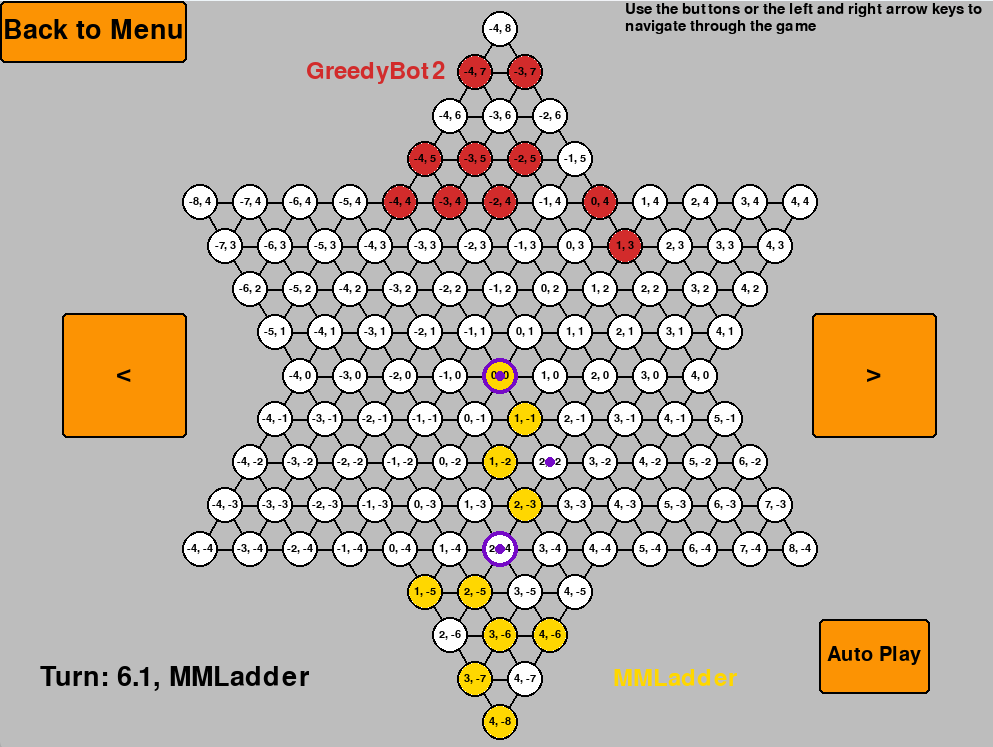

# Group 7 Assignment 1

Our group has chosen **Chinese Checkers** as our game.




The GUI is adapted from [henrychess's repository](https://github.com/henrychess/pygame-chinese-checkers/). The group's work has been explained in a [Contribution](#contribution) section below.

## Table of Contents

<!-- toc -->
- [Folder Directory](#folder-directory)
- [Cloning the Repository](#cloning-the-repository)
- [Installing Python Environment](#installing-python-environment)
- [Running the program](#running-the-program)
- [Development](#development)
- [Contribution](#contribution)
<!-- tocstop -->

## Folder Directory

```bash
assignment1
├── bots
│   ├── __init__.py
│   ├── BotTemplate.py
│   ├── GreedyBot0.py
│   ├── GreedyBot1.py
│   ├── GreedyBot2.py
│   ├── GroupBot.py
│   ├── LadderBot.py
│   ├── MMCluster.py
│   ├── MMLadder.py
│   └── RandomBot.py
├── config
│   ├── config-mmcluster-greedy1.yaml
│   ├── config-mmcluster-greedy2.yaml
│   └── config-mmladder-greedy2.yaml
├── game_logic
│   ├── __init__.py
│   ├── game.py
│   ├── helpers.py
│   ├── human.py
│   ├── layout.py
│   ├── piece.py
│   └── player.py
├── gui
│   ├── __init__.py
│   ├── constants.py
│   ├── gui_helpers.py
│   └── loops.py
├── assets
│   ├── bots_development.md
│   └── game_selection.md
├── replays
│   ├── MMCluster_Greedy2.txt
│   ├── MMCluster_MMLadder.txt
│   └── MMLadder_Greedy2.txt
├── README.md
├── main.py
├── requirements.txt
├── LICENSE
├── pyproject.toml
└── display_coordinates.py
```

## Cloning the Repository

For external viewers/examiners,

```bash
git clone https://github.com/yufanana/ArtificialIntelligence02180.git
```

## Installing Python Environment

Change directory into the `assignment1` folder

### With Anaconda

To create a new environment, with Python version 3.12, run:

```bash
conda create -n g7_ai1 python=3.12
```

To activate an environment, run:

```bash
conda activate g7_ai1
```

To install the Python packages, run:

```bash
python -m pip install -r requirements.txt
```

### With venv

```bash
cd ArtificialIntelligence02180/assignment1
python3 -m venv .venv
source .venv/bin/activate
pip install -r requirements.txt
```

### With virtualenv

```bash
cd ArtificialIntelligence02180/assignment1

pip install virtualenv
virtualenv .venv
source .venv/bin/activate
pip install -r requirements.txt
```

On Windows,

```bash
cd ArtificialIntelligence02180/assignment1

pip install virtualenv
virtualenv .venv
.venv/Scripts activate
pip install -r requirements.txt
```

## Running the program

First, open a terminal and change to the directory containing `assignment1`.

The command on Linux/Mac should look like this:

```bash
# Linux/Mac
cd ~/ArtificialIntelligence02180/assignment1

# Windows
cd \ArtificialIntelligence02180\assignment1
```

To start the game, run:

```bash
conda activate g7_ai1
python main.py
```

The game will then prompt you to select players after clicking `Play`.

If you want to close the window, you can quit the game by clicking the X button on the top of the window or go to the terminal and press `Ctrl + C` or `cmd + C`.

## Development

For developers, follow [this tutorial](https://docs.github.com/en/authentication/connecting-to-github-with-ssh/generating-a-new-ssh-key-and-adding-it-to-the-ssh-agent) to add SSH keys to your GitHub.

Run this command to clone.

```bash
git clone git@github.com:yufanana/ArtificialIntelligence02180.git
```

To create new custom bots, refer to [bots_development](assets/bots_development.md) for instructions on how to create your own custom bots.

### Updating your Branch

1. Commit whatever changes you have on your branch.

```bash
git add .
git commit -m "describe your changes"
```

2. Change to the main branch

```bash
git checkout main
```

3. Get the latest updates

```bash
git pull
```

4. Change back to your adversarial branch

```bash
git checkout my-adversarial
```

5. Rebase your branch onto the main branch

```bash
git rebase main
```

6. If there are any conflicts, resolve them in VS Code. Find the files that have been highlighted red with an exclamation mark in the `Folder Explorer`. After you have resolved the conflicts, run

```bash
git rebase --continue
```

7. Done! :)

### Configurations

 - The configurations for the game set up can be modified in the [`config.yaml`](config/config0.yaml) files inside the [`config`](config) folder.
- To use a different config for a game, modify the `config_name` parameter inside `main()` in [`main.py`](main.py)
- The string to represent the player type should be exactly the class name. </br>
e.g. `Human` and not `human`, `GreedyBot0` and not `Greedybot`.

## Contribution

The code has been reorganised to have 3 main packages: `bots`,`game_logic`,`gui`.

Our group has placed most of work as new scripts and bots in the `bots` package.

